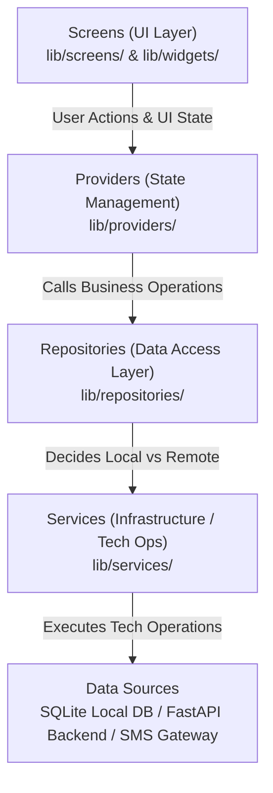

# RelyCare - System Architecture

## Overview

RelayCare is an offline-first digital referral tracking system designed for low-connectivity healthcare environments. This document outlines the architectural patterns and layered separation of concerns used across the codebase.

---

## Architectural Pattern: Layered Clean Architecture

RelayCare uses a layered architecture to keep UI, state management, business logic, data access, and infrastructure separate and decoupled.

### Flow Breakdown

1. **Screens & Widgets (`lib/screens/`, `lib/widgets/`)**
   - Present UI components to the user.
   - Listen to state changes from Providers.
   - Dispatch user actions to Providers.
   - Contain **no** direct database or network calls.

2. **Providers (`lib/providers/`)**
   - Manage application state and UI view states (using `ChangeNotifier`).
   - Coordinate actions with Repositories.
   - Expose clean state objects and status flags (loading, success, error) to the UI.

3. **Repositories (`lib/repositories/`)**
   - Act as the single source of truth for domain data.
   - Decide whether to fetch/write to the local database, network API, or sync queue.
   - Abstract away storage mechanics from state management.

4. **Services (`lib/services/`)**
   - Perform technical and hardware/network operations (e.g., SQLite operations, HTTP requests, SMS formatting, identity matching algorithms, network connectivity monitoring).
   - Contain **no** UI-specific code.

---

## Why This Architecture?

1. **Separation of Concerns:** Each teammate can work on a distinct layer (e.g., UI, Database, API, Matching) without stepping on each other's toes.
2. **Offline-First Readiness:** The repository layer seamlessly hides whether data came from SQLite or FastAPI backend.
3. **Safe by Default:** Clinical data flow and SMS payload restrictions are strictly enforced at the service and repository boundaries.
4. **Beginner-Friendly & Testable:** Clear boundaries make it straightforward to unit test services/repositories and mock dependencies.
