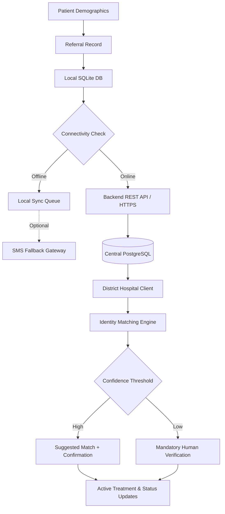

# RelyCare - Data Flow & Privacy Policy

This document describes how data flows across the system layers, privacy rules, and data minimization constraints for SMS and offline payloads.

---

## End-to-End Data Pipeline



---

## Data Privacy & SMS Security Rules

> [!CAUTION]
> **SMS Payload Strict Limitation**: Plain SMS is an unencrypted, insecure channel. NEVER transmit medical diagnoses, detailed clinical notes, HIV/reproductive health indicators, or sensitive identifiers over plain SMS.

### Permitted Data in SMS Fallback Payload
Only minimal routing metadata is allowed in an SMS message:
1. Short Referral Code / Token (e.g., `RC-A7X92`)
2. Source Facility Code (e.g., `PHC-104`)
3. Destination Facility Code (e.g., `DH-02`)
4. Anonymized initials or hashed placeholder (e.g., `P:R.K.`)
5. Timestamp / Urgency level code (e.g., `U:HIGH`)

### Example SMS Payload
```text
RELYCARE#RC-A7X92#PHC104#DH02#RK#U2#20260919
```

When the patient arrives at the destination hospital, the full clinical notes are retrieved either when the network resumes or via QR/local peer transfer.
