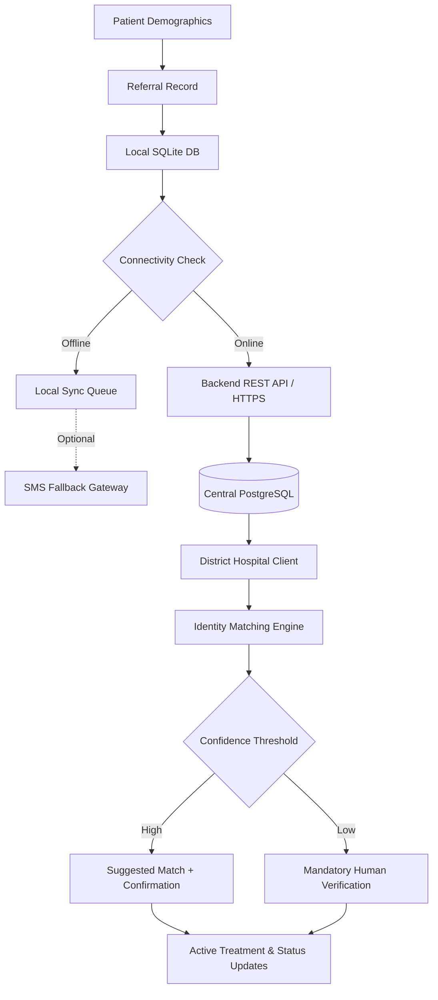

# RelyCare - Data Flow & Privacy Policy

This document describes how data flows across the system layers, privacy rules, and data minimization constraints for SMS and offline payloads.

---

## End-to-End Data Pipeline



---

## Data Privacy & SMS Security Rules

> [!CAUTION]
> **SMS Payload Strict Limitation**: Plain SMS is an unencrypted, insecure telecom channel. NEVER transmit medical diagnoses, detailed clinical notes, HIV/reproductive health indicators, or full personal identifiers over SMS.
> 
> *Note:* In Phase 6, SMS delivery operates using a simulated/mock gateway (`MockSmsService`). No real telecom networks are contacted.

### Permitted Data in SMS Fallback Payload (Minimum Data Principle)
Only the absolute minimum operational routing metadata is included in an SMS fallback message:
1. Referral Identifier / Token (`REF: RC-2026-000142`)
2. Originating PHC Facility Code (`PHC: PHC-MUM`)
3. Sanitized Patient Name (`PAT: Rahul S` — First name + initial only)
4. Patient Age (`AGE: 42`)
5. Destination Facility Code (`DST: DIST-HOSP-01`)

### Deterministic SMS Message Format
```text
RelyCare Referral
REF: RC-2026-000142
PHC: PHC-MUM
PAT: Rahul S
AGE: 42
DST: DIST-HOSP-01
```

### Privacy Guarantee
- **Excluded Data:** Symptoms, diagnoses, clinical notes, prescribed treatments, and full contact details are **strictly prohibited** from SMS payloads.
- **Out-of-Band Delivery:** SMS serves purely to alert receiving facilities of an inbound referral. The complete medical file is synchronized via the encrypted HTTPS API when connectivity is restored or accessed securely via direct patient verification.

---

## Centralized HTTPS API Data Flow (Phase 7)

When client devices are connected to the network, the Flutter `SyncService` batches and uploads queued referral operations to FastAPI via HTTPS:

1. **Payload Serialization:** Referral models in SQLite are serialized into validated JSON matching `ReferralCreate` Pydantic schema.
2. **REST Ingestion:** Sent to `POST /api/v1/referrals`.
3. **Duplicate Detection:** Server checks for matching `referral_id`. Duplicate attempts safely return `409 Conflict` without data corruption.
4. **PostgreSQL Commit:** Server commits record to centralized PostgreSQL `referrals` table and returns `201 Created` with ISO timestamps.
5. **Local Sync State Transition:** Only upon receiving successful HTTP response does the client transition local SQLite record to `SYNCED`.


