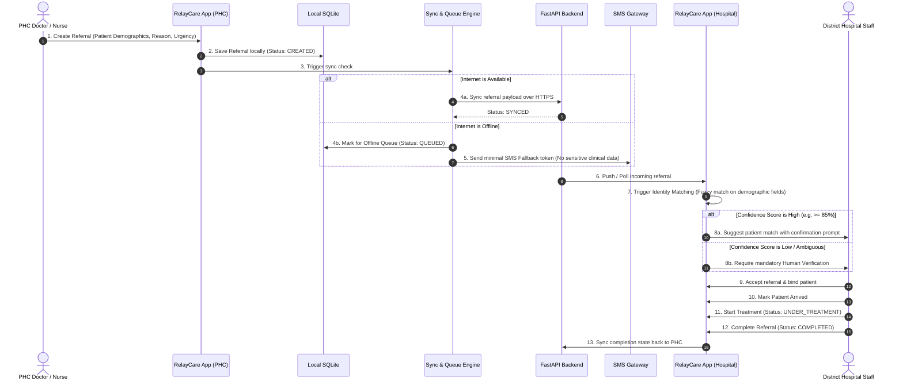

# RelyCare - Referral Lifecycle & End-to-End Flow

This document details the step-by-step lifecycle of a healthcare referral within RelyCare, spanning from the Primary Health Centre (PHC) to the District Hospital.

---

## Complete Referral Flowchart

---

## Detailed Step Description

1. **PHC Creation:** Clinician inputs basic patient demographic details, reason for referral, urgency tier, and destination facility.
2. **Local Persistence:** Data is committed to local SQLite storage first, ensuring zero data loss if the app closes or the device loses power.
3. **Connectivity Evaluation:** App checks network state.
4. **Online Path:** If online, sends JSON payload to FastAPI backend and updates status to `SYNCED`.
5. **Offline Path & SMS Fallback:** If offline, queues the record in local queue and triggers SMS fallback with a lightweight anonymized token (`RC-REF-XXXX`).
6. **Receiving Facility Intake:** District Hospital views incoming referrals in their dashboard.
7. **Identity Matching:** System runs matching algorithm (name fuzzy distance, age bounds, gender, village/location) against existing hospital records.
8. **Confidence Tiering:**
   - **High Confidence:** App presents candidate with match explanation.
   - **Low/Ambiguous Confidence:** App highlights discrepancies and requires explicit human clinician verification.
9. **Referral Acceptance & Treatment:** Hospital clinician admits patient, updates clinical progression, and completes referral.
10. **Two-way Sync:** Final status is synchronized back across the network when connection is active.
